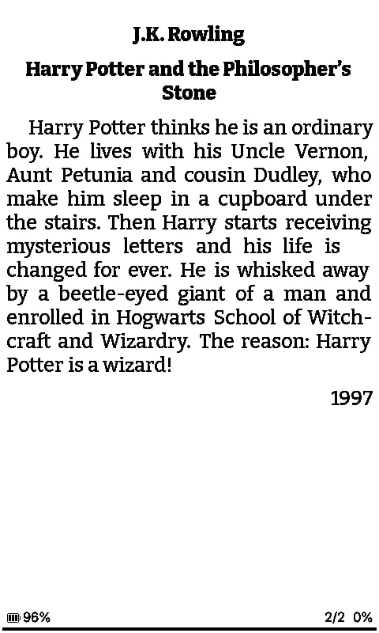
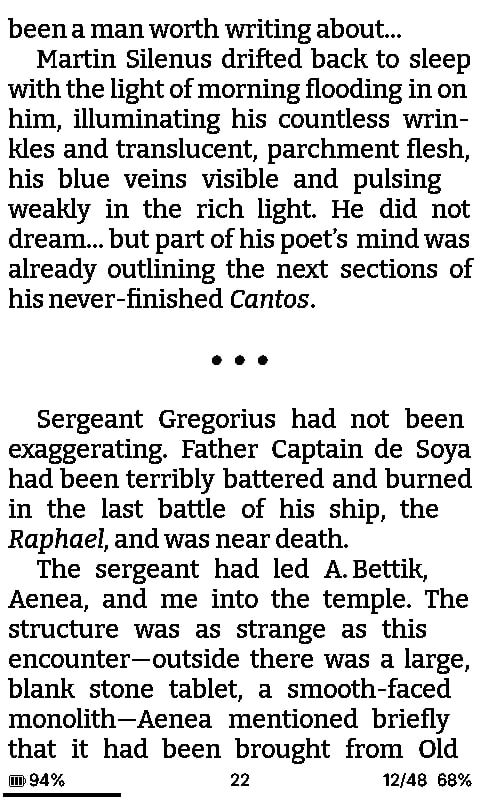
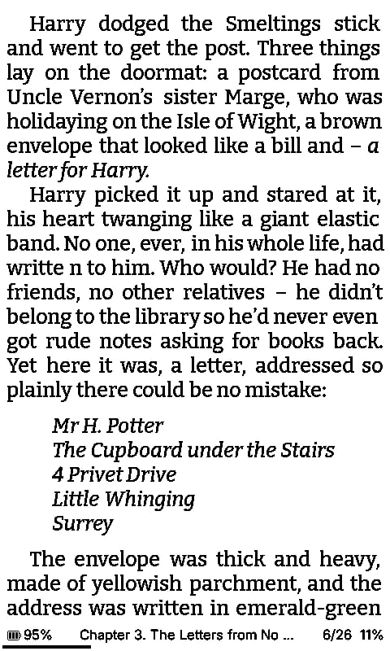

# inkMOD 1.1.6 — FB2 formatting, stability and usability

> **Credits:** Alpa4hinO — development; Olimo — ideas and testing.  
> Thanks also to everyone who contributed smaller suggestions, bug reports and test cases.

The main focus of **inkMOD 1.1.6** was beautiful and faithful FB2 rendering without sacrificing stability on the memory-constrained Xteink X3/X4.

## Beautiful FB2 rendering

FB2 does not carry embedded CSS in the same way EPUB does. Instead, the book describes its structure using semantic tags, and the reader decides how those elements should look.

In FB2 books, inkMOD now renders more of that structure intentionally and consistently:

- annotations and epigraphs are visible;
- headings are separated from body text with spacing;
- subtitles are centered and bold;
- quotes have spacing around them;
- poems have spacing around them;
- individual stanzas are separated from each other;
- when a verse line is too long for the screen, the continuation receives a larger indent;
- the author of a quote or poem is aligned to the right;
- image support has been improved;
- `<emphasis>` is supported in all tested FB2 styles.

A particularly important goal was to make italic/roman text depend on **what the book itself says**, rather than forcing italics on an entire element.

If an epigraph, poem or quote is italicized in the FB2 file, it is shown in italics. If it is not italicized in the source, it stays roman. If only a few words are wrapped in `<emphasis>`, only those words are italicized.

In other words, the aim was not to redesign the book, but to preserve as much of the author's and publisher's intended structure as possible.

### Examples

<table>
<tr>
<td align="center"> Annotation and book metadata</td>
<td align="center"> Dedication / epigraph formatting</td>
<td align="center"> Section break and structured text</td>
</tr>
<tr>
<td align="center"> Quote, subtitle and emphasis</td>
<td align="center"> Inline emphasis and indented block</td>
<td align="center"> Poem / verse layout</td>
</tr>
</table>

### How to enable FB2 styles

**English UI:**

`Settings → Reader → Embedded Style → ON`

`Settings → Reader → Page Layout → Paragraph Alignment → Book's Style`

**Русский интерфейс:**

`Настройки → Читалка → Встроенный стиль → ВКЛ`

`Настройки → Читалка → Разметка страницы → Выравнивание абзацев → Стиль книги`

If this style is not to your taste, simply disable these options. 🙂

---

## Streaming FB2/EPUB without stripping formatting

Pretty FB2 rendering was only part of the work. The internal handling of large **FB2 and EPUB** books also had to be reworked because Xteink X3/X4 have very limited RAM and no PSRAM.

The main rule of the new approach is simple: **do not simplify the book just to save memory**.

Images, styles, spaces, paragraph structure and other formatting should not disappear just because the device is memory-constrained. Instead, large FB2 content is processed incrementally.

Text and XML no longer have to remain in RAM as one giant block, and temporary data from previous parts can be released before processing the next part. This significantly improves stability on large or structurally complex books.

A lot of effort also went into making the streaming layer visually invisible. Internal memory chunk boundaries must not become formatting boundaries. They should not create extra paragraph indents, blank half-pages, extra spaces, artificial line breaks or split words such as `п ривет` instead of `привет`.

An unfinished word is now preserved until a real word boundary is reached, and streaming is designed to leave the author's spaces, paragraphs, italics, images and FB2 structure intact.

---

## More stable pagination for large chapters

Very large FB2 chapters may internally be split into multiple `spine` fragments so that the device can render them safely.

Previously this could produce counters such as:

`40/40 → next page → 41/45` 😅

inkMOD now determines the full logical chapter size and locks the exact page total for that chapter. The result is also persisted in the book's service cache under `.inkmod` on the SD card, so the reader does not have to rediscover the denominator every time.

---

## Dictionary pagination: from seconds to milliseconds

A surprising bottleneck was found in dictionary article pagination.

The actual dictionary lookup typically took only about **100–150 ms**, but a small article could then spend another **20–25 seconds** being paginated.

Profiling showed that the expensive part was repeated text-width calculation. After changing the algorithm, a real-device test showed:

- **before:** ~21–25 seconds;
- **after:** ~2 ms for article pagination 🚀;
- font metrics preparation: ~30 ms;
- dictionary lookup: ~100 ms.

At this point, the most noticeable remaining delay is mostly the physical E-Ink refresh itself.

---

## Clippings improvements

The clipping workflow received several fixes and usability changes:

- fixed the case where starting a selection sometimes required pressing the button twice;
- faster movement is available while holding navigation buttons;
- **Create Clipping** can be assigned directly to a physical button or a long-press action in button settings, so opening the book menu is no longer required every time.

---

## Hold-to-repeat navigation

Ordinary menus and lists now support repeated movement while a button is held:

- short press → move by one item;
- hold for about **0.5 s** → continue moving approximately once every **0.5 s**.

Specialized screens can keep their own accelerated behavior. For example, chapter selection still allows precise single-step movement while providing faster navigation for long lists.

---

## File browser cleanup

PNG and BMP files are now treated consistently as images rather than as strange "books". 🙂

Changes include:

- PNG uses the same image-style icon as BMP;
- EPUB/FB2 icons are handled more consistently;
- PNG/BMP information screens report the actual format instead of `-`;
- image context menus use file/image wording instead of **Book information**;
- PNG and BMP can both use the image install action;
- the old path that could create an extra `/sleep.bmp` copy in the SD root is no longer required for new selections;
- selecting a wallpaper/sleep image no longer has to overwrite the existing **Lock screen** mode;
- the original selected image can be referenced directly, while legacy `/sleep.bmp` remains supported for compatibility.

---

## Clearer file-extension setting

The option formerly named:

**Hide file extensions**

has been renamed to:

**Show file extensions**

Its behavior now matches the wording directly:

- **ON** — extensions are shown;
- **OFF** — extensions are hidden.

This matches the logic of **Show hidden files** and removes the previous double-negative behavior.

---

## Closing note

What started as "let's make FB2 look a little nicer" turned into a fairly large release. 😄

The important goal is that Xteink X3/X4 should not force readers to choose between a **beautiful book** and a **stable book**.

inkMOD 1.1.6 aims to preserve author formatting, images, italics, quotes, poetry and text structure while still keeping large books usable on devices with very limited RAM and no PSRAM.

And judging by the latest real-device tests, we are getting very close to that goal.
