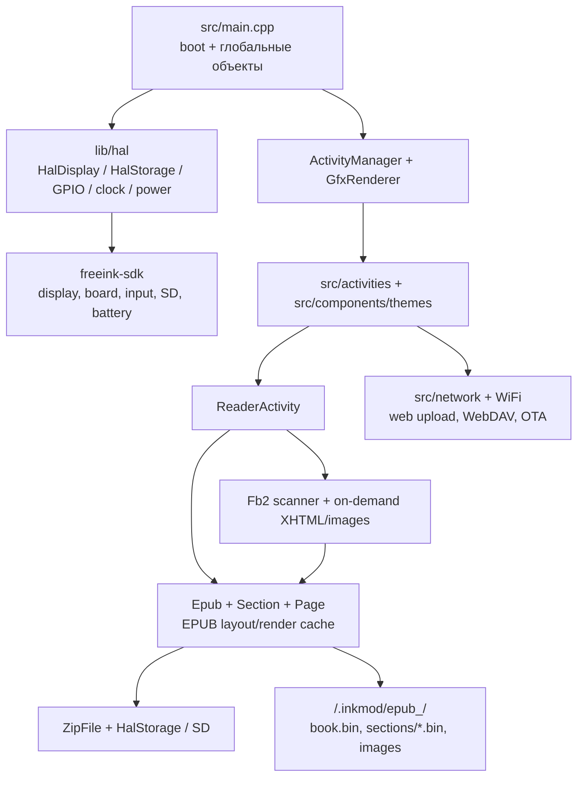

# Аудит архитектуры inkMOD

Дата аудита: 2026-08-08  
Статус: **первый этап миграции; код прошивки не менялся**.

## Вывод

inkMOD уже не является монолитом, в котором драйверы панели смешаны с
читателем: физическое устройство изолировано в `freeink-sdk`, а прикладной
код находится в `src/` и `lib/`. Однако EPUB-часть пока объединяет четыре
ответственности: доступ к SD, разбор документа, вёрстку и рисование. Поэтому
безопасная миграция должна идти через новые узкие адаптеры рядом со старым
путём, а не через замену рабочего EPUB-ридера одним большим коммитом.

Главное ограничение — ESP32-C3 без PSRAM. Один framebuffer уже занимает
48 000 байт (`HalDisplay::BUFFER_SIZE`, [HalDisplay.h](../lib/hal/HalDisplay.h#L32)).
Нельзя закладывать мегабайтные RAM-бюджеты для `DocumentModel`, layout или
изображений: всё крупное должно быть потоковым или храниться в кэше на SD.

## Методика и границы уверенности

Аудит сделан по текущему дереву исходников, PlatformIO-конфигурации, истории
репозитория и существующей документации форматов. Единственный настроенный
remote — `alpzoloto-sudo/inkmod`; история начинается импортом
`inkMOD source` (commit `b100197`). Поэтому нельзя честно установить автора
каждой строки только по этому репозиторию. Ниже «унаследовано/внешнее» значит
*техническая граница и происхождение, подтверждённое деревом и лицензией*, а
не юридическое заключение. Перед удалением или переносом кода обязателен
отдельный license/provenance audit.

## Карта текущей системы



### Загрузка и глобальные зависимости

`src/main.cpp` создаёт `mappedInputManager`, `renderer` и `activityManager`
как глобальные объекты ([main.cpp](../src/main.cpp#L97)-[L99]), затем в
`setup()` запускает GPIO, питание и SD
([main.cpp](../src/main.cpp#L704), [L736-L748](../src/main.cpp#L736-L748)).
Это даёт простой путь запуска, но означает, что activity и reader получают
рендерер и input напрямую. `ActivityManager` также сам создаёт render-task и
держит глобальный singleton ([ActivityManager.h](../src/activities/ActivityManager.h#L43),
[L62-L132](../src/activities/ActivityManager.h#L62-L132)).

| Граница | Текущее состояние | Риск при миграции | Безопасное направление |
| --- | --- | --- | --- |
| Display | `HalDisplay` оборачивает `EInkDisplay`, владеет framebuffer и refresh ([HalDisplay.h](../lib/hal/HalDisplay.h#L5-L73)) | второй framebuffer или прямой доступ к панели быстро исчерпает RAM | оставить текущий драйвер единственным владельцем буфера; новый `Display` — тонкий интерфейс над ним |
| Storage | singleton `Storage` и move-only `HalFile` ([HalStorage.h](../lib/hal/HalStorage.h#L13-L94)) | один SD-слой уже защищён mutex; несколько долгоживущих файлов конфликтуют на железе | вводить потоковые reader-адаптеры, закрывать handle до следующей операции |
| Input / power / clock | `HalGPIO`, `HalPowerManager`, `HalClock`, globals | сон и wake зависят от порядка boot | оборачивать только после стабилизации контракта, не переносить sleep-логику в reader |
| UI lifecycle | Activities владеют экранной логикой и ссылками на renderer/input ([Activity.h](../src/activities/Activity.h#L16-L57)) | Reader UI знает детали документа и storage | вынести сначала presentation/model interfaces, сохранить Activity как shell |
| Network | `src/network/`, а Wi-Fi вызывается из activity/settings | смешение транспорта с UI | будущий `Network` facade; вне критического пути reader migration |

## Владение кодом и внешние зависимости

| Область | Статус | Наблюдение и решение |
| --- | --- | --- |
| `freeink-sdk/` | внешний SDK, не часть reader migration | README SDK описывает независимый FreeInk SDK и совместимость с исходным API. Это правильное место для физических драйверов и базового UI-адаптера; менять его только отдельными upstream-совместимыми PR. |
| `lib/hal/` | inkMOD facade поверх SDK, но с глобальными singleton | Уже полезная граница. Не создавать второй конкурирующий HAL: постепенное новое `src/hal/` должно делегировать существующим `Hal*` либо после проверки заменить их реализацию. |
| `src/activities/`, `src/components/`, `src/network/`, settings/stores | прикладной слой inkMOD, часть файлов исторически смешанная | Здесь находятся экранные сценарии, темы, поиск, веб-загрузка, настройки и статистика. Нужен перенос зависимостей, не переписывание UI. |
| `lib/Epub/` | смешанный reader engine | Содержит EPUB parsing/CSS, pagination, сериализацию и render code. Основной кандидат на разделение. |
| `lib/Fb2/` | inkMOD-specific adapter поверх EPUB pipeline | FB2 уже лениво сканируется и отдаёт главы в EPUB-поток; это полезный промежуточный слой, а не повод для второго layout engine. |
| `lib/ZipFile/`, `lib/InflateReader/`, `lib/uzlib/`, `lib/expat/`, decoders | инфраструктура/third-party или адаптированная | Требует фиксации лицензий и происхождения в `THIRD_PARTY.md` до копирования кода в новый engine. |
| `web/`, `scripts/` | inkMOD web portal и генерация | Исходники web редактируются только в `web/`; `src/network/html/*.generated.h` — производные файлы. |

## Читатель: фактическое сцепление

### EPUB

`ReaderActivity` выбирает формат, создаёт `Epub` и сразу заменяет activity на
`EpubReaderActivity` ([ReaderActivity.cpp](../src/activities/reader/ReaderActivity.cpp#L32-L104)).
`EpubReaderActivity` держит одновременно `Epub`, `Section`, позицию, прогресс,
footnotes, UI и статистику ([EpubReaderActivity.h](../src/activities/reader/EpubReaderActivity.h#L12-L119)).

`Epub` сам читает ZIP/пакет и CSS, хранит кэш метаданных и предоставляет
`readItemContentsToStream()` ([Epub.h](../lib/Epub/Epub.h#L17-L99)). `Section`
получает `GfxRenderer&` в конструкторе и при создании section cache принимает
параметры экрана и шрифта ([Section.h](../lib/Epub/Epub/Section.h#L12-L48)).
`Page`/`PageElement` не являются нейтральной моделью: у них есть виртуальные
`render(GfxRenderer&)` методы ([Page.h](../lib/Epub/Epub/Page.h#L22-L28)) и
`std::vector` графических элементов ([Page.h](../lib/Epub/Epub/Page.h#L130-L132)).

**Следствие:** новый layout нельзя подключать, просто заменив HTML parser. Сначала
нужно отделить измерение текста от рисования и заменить `Page` на ограниченные
render commands/anchors, совместимые с существующим section cache на переходный
период.

### FB2 и FB2.ZIP

FB2 уже следует желаемой общей траектории: `Fb2::load()` строит компактный
индекс, а `renderChapterOnDemand()` отдаёт XHTML по запросу EPUB pipeline
([Fb2.h](../lib/Fb2/Fb2.h#L24-L67)); изображение декодируется только при показе
([Fb2.h](../lib/Fb2/Fb2.h#L75-L80)). Это нельзя заменить eager-конвертацией
всей книги. Для FB2.ZIP нужен такой же потоковый источник/распаковка в cache,
но DocumentModel должен видеть один и тот же API независимо от контейнера.

В `lib/Fb2/native/` уже есть независимый `IByteReader`
([IByteReader.h](../lib/Fb2/native/IByteReader.h#L16)) и `FsFileReader`
([FsFileReader.h](../lib/Fb2/native/FsFileReader.h#L26)). В фазе 3 его надо
поднять в общий `core/io`, сохранив ABI или добавив адаптер, а не вводить второй
похожий интерфейс.

### ZIP, изображения, шрифты, статистика и прогресс

* `ZipFile` держит `HalFile`, умеет потоковую выдачу файла, но также имеет
  `readFileToMemory()` и `unordered_map<string, FileStatSlim>`
  ([ZipFile.h](../lib/ZipFile/ZipFile.h#L9-L72)). Это hotspot для лимитов,
  лимитированных кэшей и защиты от больших центральных каталогов.
* Картинки в EPUB проходят через `ImageBlock` и framebuffer-oriented converters;
  это ещё одно прямое соединение parser/layout/render. Новая модель должна
  хранить только image reference + размер/placement, а decoder запускать по
  render command.
* Шрифты и метрики сейчас являются возможностями `GfxRenderer`; будущему
  `TextMeasurer` нужен только узкий интерфейс метрик/кернинга, без доступа к
  framebuffer.
* Метаданные и laid-out sections уже лежат на SD в
  `/.inkmod/epub_<hash>/` ([file-formats.md](file-formats.md#L3)); `book.bin`
  имеет version 7, `section.bin` — version 40
  ([file-formats.md](file-formats.md#L9), [L93-L103](file-formats.md#L93-L103)).
  Существующий section cache зависит от каждого layout-setting и является
  рабочим контрактом, который нельзя молча перезаписать.
* Прогресс, закладки и статистика сейчас живут рядом с reader activity и cache.
  В новой схеме они должны получать стабильный `BookId` и `PageAnchor`, а
  legacy files надо читать до явной миграции.

## Прямые точки зависимости от платформы

1. Reader и EPUB напрямую используют `HalStorage`/`FsFile`; это видно в
   `Epub`, `Section`, `Page`, `ImageBlock`, `BookReadingStats` и `Fb2`.
2. Вёрстка и `Page` напрямую используют `GfxRenderer`: метрики, font cache,
   orientation и пиксельный буфер находятся внутри той же ветви вызовов.
3. `ActivityManager` владеет render task и lifecycle; parser/layout не должны
   получать `ActivityManager` или вызывать refresh сами.
4. `main.cpp` определяет глобальные singleton, в том числе `renderer` и
   `activityManager` ([main.cpp](../src/main.cpp#L97-L99)); новые сервисы надо
   передавать явно в новые компоненты, а не добавлять глобалы.

## Целевая граница (проект, не текущая реализация)

```text
HAL -> Core -> Storage -> Document Model -> Format adapters -> Layout
    -> Render commands -> Renderer -> Reader UI -> Library/UI
```

Правила этой границы:

* `DocumentModel`, format adapters и layout не включают `GfxRenderer`,
  `Activity`, `WiFi` или `HalDisplay`.
* Storage выдаёт последовательный reader и короткоживущий file handle; ZIP
  inflation не требует хранить весь item в RAM.
* Layout получает `TextMeasurer` и `LayoutConstraints`, а возвращает
  фиксированные/лимитированные render commands и `PageAnchor`.
* Только renderer знает framebuffer, refresh mode и image decoder.
* Только Reader UI знает кнопки, меню, сон и status bar.

## Риски и обязательные стоп-условия

| Риск | Мера до начала переключения |
| --- | --- |
| OOM/фрагментация на большой книге | `new (std::nothrow)`/`makeUniqueNoThrow`, фиксированные лимиты, heap/min-free telemetry и отказ с понятным сообщением; никаких whole-book `String`/`vector` |
| Неправильная позиция после смены шрифта/сна | versioned `PageAnchor`; старый progress читается через adapter; cache key включает layout spec |
| Повреждение cache | новый cache пишется temp -> fsync/close -> rename; version/CRC/signature; legacy cache не удалять автоматически |
| SD contention | ровно один активный reader в parser/layout; renderer не держит input file открытым между кадрами |
| Регрессия EPUB/FB2 | переключатель `USE_NEW_READER=0` по умолчанию и один формат за раз |
| Лицензии | до копирования — происхождение каждого перенесённого файла и `THIRD_PARTY.md` |

## Ближайший безопасный результат

Первый кодовый PR после этого аудита должен быть **только фундаментом**:
ввести заголовки/тесты новых интерфейсов (`IByteReader`, `Storage`,
`TextMeasurer`, `PageAnchor`) без смены `ReaderActivity` и без записи нового
кэша. Подробная последовательность, критерии приёмки и rollback описаны в
[MIGRATION_PLAN.md](MIGRATION_PLAN.md).

